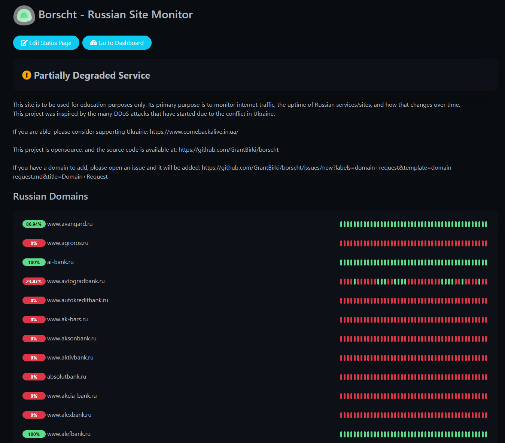
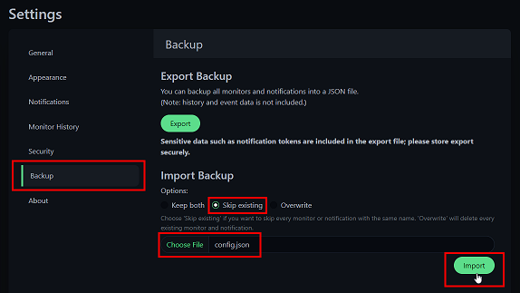
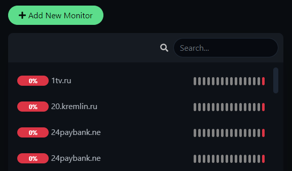
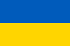

# borscht 🥣

Borscht is a simple uptime and status monitor of Russian sites and services

You can view the public status page [here](https://borscht.birki.io/status) 🔗

> Note: The site [borscht.birki.io](https://borscht.birki.io) has been taken offline because it was costing me money to run. However, you can always clone or fork this repo and host it on your own or test it our locally!

## About 💡

This project was inspired due to the conflict in Ukraine which spawned a massive community run DDoS attack against Russian owned internet domains.

I wanted to see just how many Russian sites are down due to DDoS attacks and how they trending availability wise over time.

## Example 📸

Below is an example screenshot of the app:



### DDoS Attacks 💥

> *A distributed denial-of-service (DDoS) attack is a malicious attempt to disrupt the normal traffic of a targeted server, service or network by overwhelming the target or its surrounding infrastructure with a flood of Internet traffic.*

Here is a list of various sources, projects, and comments talking about the on-going DDoS attacks:

**Key:**

- 💻 - DDoS attack related Project
- 📰 - Info Source related to DDoS attacks

**List:**

- 💻 [stoppropaganda](https://github.com/erkexzcx/stoppropaganda)
- 💻 [NoRussian](https://github.com/ajax-lives/NoRussian)
- 💻 [Community DDoS site](https://stop-russian-desinformation.near.page/)
- 📰 [reddit/r/hacking](https://old.reddit.com/r/hacking/comments/t1a8is/simple_html_dos_script_for_russian_sites/)
- 📰 [reddit/r/UkraineWarVideoReport](https://old.reddit.com/r/UkraineWarVideoReport/comments/t3l1z4/for_educational_purposes/?context=3)
- 📰 [Russia confirms DDoS #1](https://thehackernews.com/2022/03/russia-releases-list-of-ips-domains.html)
- 📰 [Russia confirms DDoS #2](https://www.bleepingcomputer.com/news/security/russia-shares-list-of-17-000-ips-allegedly-ddosing-russian-orgs/)

> Learn more about DDoS attacks [here](https://www.cloudflare.com/learning/ddos/what-is-a-ddos-attack/) (educational from [CloudFlare](https://www.cloudflare.com/))

## Adding a New Domain ➕

If you have a new domain you wish to add to the monitor, please file an issue in this repo by clicking [here](https://github.com/GrantBirki/borscht/issues/new?labels=domain+request&template=domain-request.md&title=Domain+Request)

The list of all domains currently monitored can be found [here](config/domains.txt)

## Building Locally 🧱

To build and test locally, do the following:

1. Build with docker-compose

    ```bash
    docker-compose -f docker-compose-local.yml up --build
    ```

2. Go to the [setting/backup](http://localhost/settings/backup) page and upload the [monitor config](config/config.json) in this repo

    

3. Watch all your monitors come online

    

## Disclaimer ⚠️

This project does not condone or support DDoS attacks of any kind. In many countries, DDoS attacks are considered illegal.

The "borscht" project is strictly for educational purposes and security folks who are interested in learning more about DDoS attacks in light of current events.

## What is "borscht"? 🥣

> *Borscht, also spelled borsch, borsht, or bortsch, beet soup of the Slavic countries. Although borscht is important in Russian and Polish cuisines, Ukraine is frequently cited as its place of origin.*

## Supporting Ukraine 💙💛

If you are able, please consider [supporting Ukraine](https://www.comebackalive.in.ua/).


